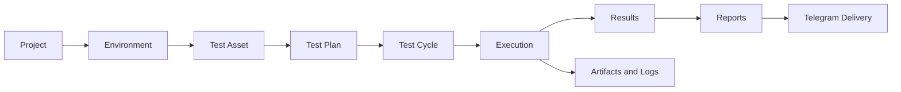

<!-- AUTO-GENERATED BY scripts/generate_qa_dashboard_docs.py. DO NOT EDIT THIS FILE DIRECTLY. -->

# Hermes QA Dashboard Documentation

Hermes QA Dashboard extends Hermes Agent with a structured workspace for managing QA configuration, reusable and versioned Test Assets, Test Plans, traceable Test Cycles, automated execution, evidence, results, reports, and delivery integrations.

**Version:** `0.8.2-alpha`
**Status:** Active Development

## Documentation

- [Product Requirements Document](product/PRD.md)
- [Product Roadmap](product/ROADMAP.md)
- [System Architecture](architecture/ARCHITECTURE.md)
- [Data Model](architecture/DATA-MODEL.md)
- [User Flows](user-flows/USER-FLOWS.md)
- [User Guide](user-guide/USER-GUIDE.md)
- [Documentation Workflow](development/DOCUMENTATION-WORKFLOW.md)
- [Feature Matrix](generated/FEATURE-MATRIX.md)
- [Route Inventory](generated/ROUTE-INVENTORY.md)
- [Store Inventory](generated/STORE-INVENTORY.md)
- [Backend API Inventory](generated/API-INVENTORY.md)
- [Release Status](generated/RELEASE-STATUS.md)
- [Attribution](ATTRIBUTION.md)

## Product Flow

