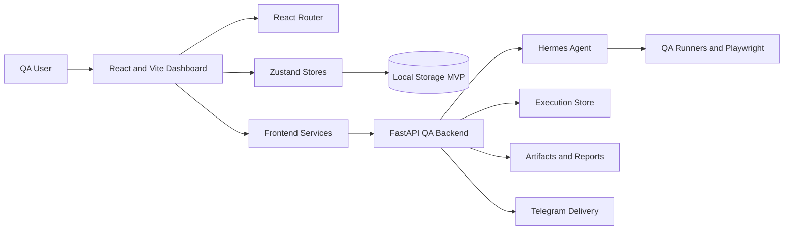
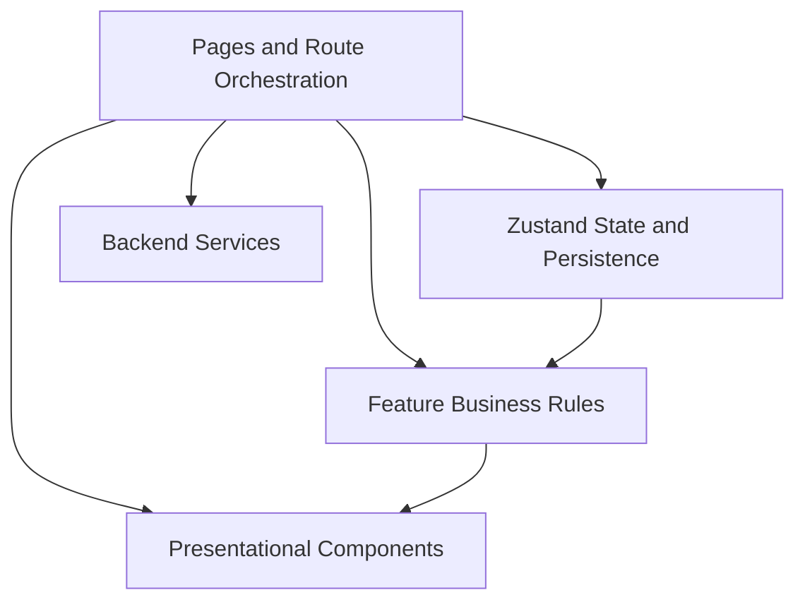

<!-- AUTO-GENERATED BY scripts/generate_qa_dashboard_docs.py. DO NOT EDIT THIS FILE DIRECTLY. -->

# System Architecture

## Context

Hermes QA Dashboard extends Hermes Agent with a structured QA management and traceability interface.

## High-Level Architecture

## Frontend Layers

## Runtime Components

- **Frontend:** React 19, React Router, Zustand, and Vite
- **Backend:** FastAPI and Hermes Agent QA execution services
- **State:** Zustand with localStorage persistence and store migrations
- **Execution:** Hermes Agent and supported QA runners
- **Evidence:** Screenshots, logs, network data, console data, and generated reports
- **Delivery:** Telegram testing and documentation topics

## Feature Domains

| Feature Domain | Source Files |
| --- | --- |
| artifacts | 4 |
| dashboard | 3 |
| executions | 5 |
| history | 3 |
| reports | 3 |
| results | 3 |
| test-assets | 6 |
| test-cycle-detail | 2 |
| test-planning | 6 |

## Architectural Rules

- No fabricated runtime data.
- Historical records must remain immutable.
- Pages orchestrate data while feature modules contain business rules.
- Presentational components do not access stores directly.
- Test Plans and Test Cycles retain snapshot traceability.
- Generated documentation must be reproducible and committed with the product.
