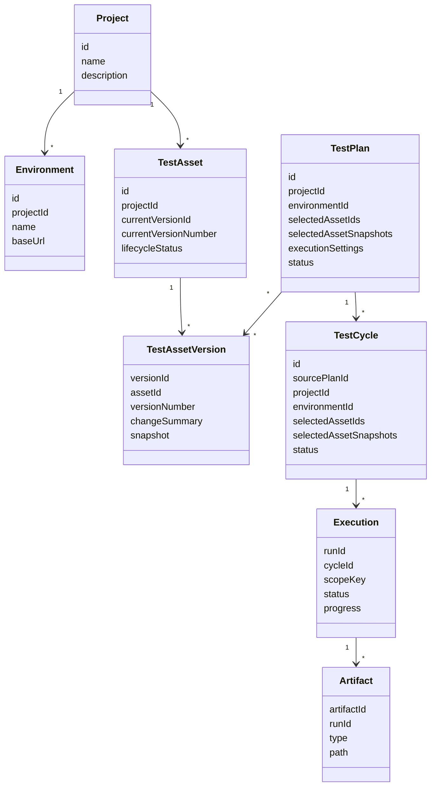

<!-- AUTO-GENERATED BY scripts/generate_qa_dashboard_docs.py. DO NOT EDIT THIS FILE DIRECTLY. -->

# Data Model

## Snapshot Rule

Test Plans and Test Cycles store captured Test Asset definitions. A later edit, archive, or deletion of the live Test Asset must not mutate the historical snapshot.
