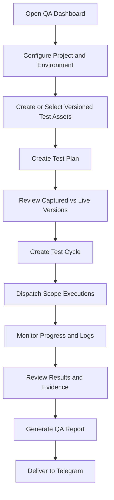

<!-- AUTO-GENERATED BY scripts/generate_qa_dashboard_docs.py. DO NOT EDIT THIS FILE DIRECTLY. -->

# User Flows

## End-to-End Flow

## Configure QA Context

1. Create or select a Project.
2. Create or select an Environment for the Project.
3. Verify the target URL and execution context.

## Create a Versioned Test Asset

1. Open Test Assets.
2. Create a Test Asset and define its type, module, feature, steps, and expected result.
3. Mark the asset as Execution Ready when its definition is complete.
4. Edit the asset with a Change Summary to create a new immutable version.

## Prepare a Test Plan

1. Open Test Planning.
2. Choose Project, Environment, cycle type, and testing scope.
3. Select compatible Test Assets.
4. Configure execution and evidence settings.
5. Save the plan to capture current Test Asset versions.

## Create and Execute a Test Cycle

1. Create a cycle directly or from a Test Plan.
2. Review Project, Environment, scope, and selected asset definitions.
3. Create the cycle and dispatch supported scope executions.
4. Monitor progress, telemetry, logs, results, and artifacts.
5. Review the consolidated result and release status.

## Review Historical Traceability

1. Open a historical Test Plan or Test Cycle.
2. Review captured Test Asset version IDs and definitions.
3. Compare captured versions with the current live catalog.
4. Confirm each execution retained the cycle request snapshot.
5. Review version-aware report coverage and execution results.
